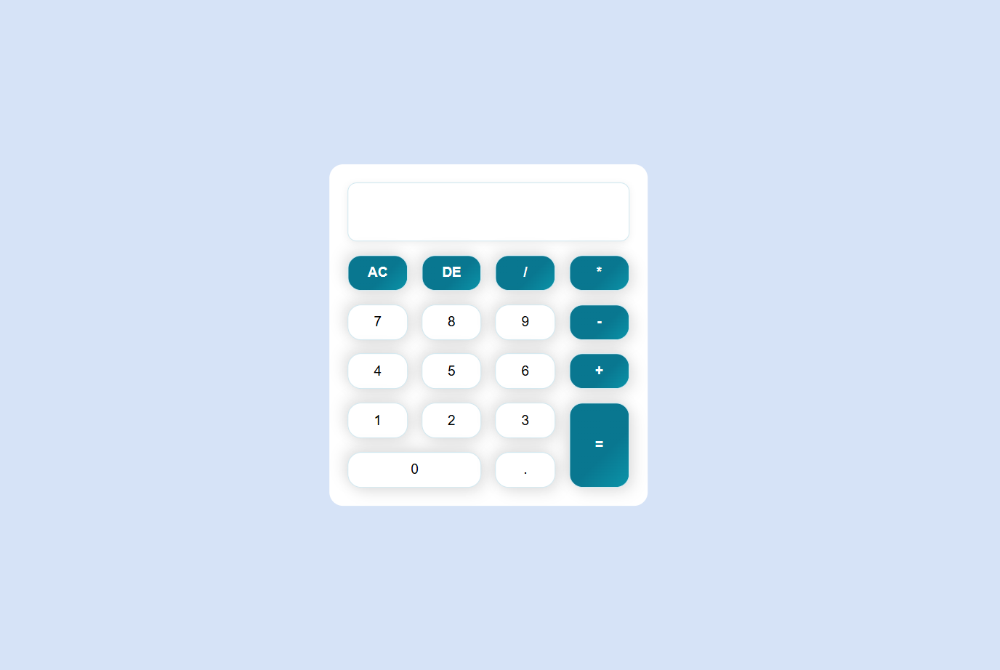

# Calculator App

A simple and elegant calculator built using **HTML**, **CSS**, and **JavaScript**.  
It supports both **button clicks** and **keyboard input** for a smooth user experience.

---
## Live Demo
🔗 [View the Live Demo](https://engnada-s.github.io/CodeAlpha_Calculator/)  

---
## Features

- Basic arithmetic operations: `+`, `-`, `*`, `/`
- Decimal support (`.`)
- Delete last digit (DE)
- Clear all (AC)
- Evaluate expression (`=`)
- Keyboard input support:
  - `Enter` → Equals (`=`)
  - `Backspace` → Delete (`DE`)
  - `Escape` → Clear (`AC`)
- Error handling for invalid expressions
- Displays result in real-time

---

## Technologies Used

- **HTML5** for structure  
- **CSS3** for styling  
- **JavaScript (ES6)** for logic and interactivity
